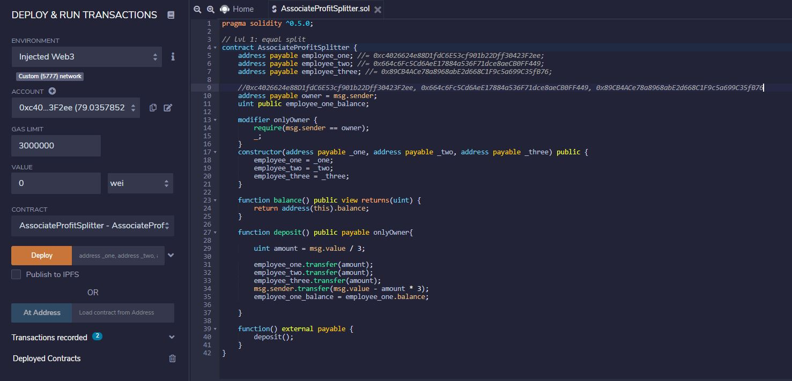
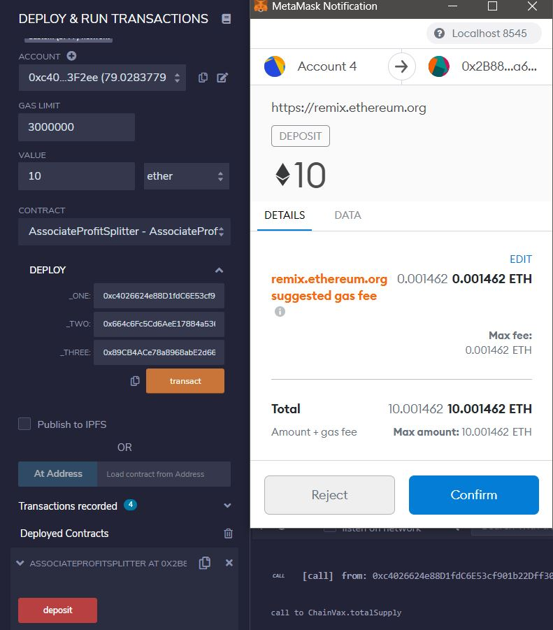

# Profit_Splitter_sol

## Looks like we've made our First Contract! ##

---

My new startup company has created its own Ethereum-compatible blockchain to help connect financial institutions, and the team wants to build smart contracts to automate some company finances to make everyone's lives easier, increase transparency, and to make accounting and auditing practically automatic!

This contract will accept Ether and divide it evenly among the associate level employees. This will allow the Human Resources department to pay employees quickly and efficiently.

At the top of my contract, you will see three `public` variables:

* `employee_one` -- The `address` of the first employee.

* `employee_two` -- Another `address payable` that represents the second employee.

* `employee_three` -- The third `address payable` that represents the third employee.

The main function is the 'deposit' function which will transfer any amount from the owner of the contract and divide the amount into 3 equal payments and transfered to each employee.

If any amount is left over, that amount will be returned to the owner.

